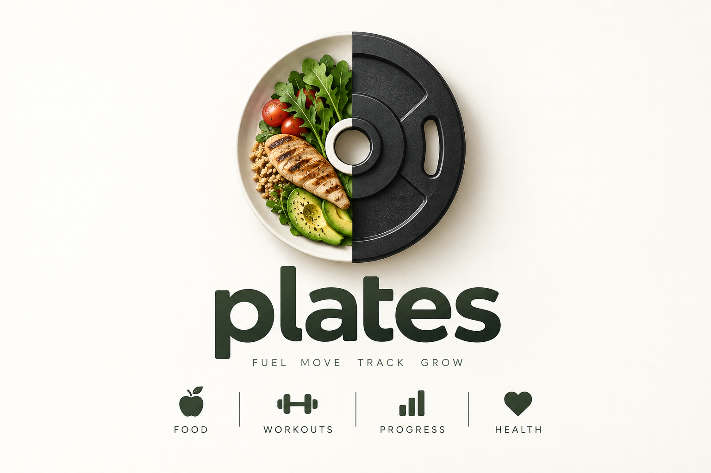

# Plate

<p align="center">
  
</p>

Two things go on a plate: what you lift, and what you eat. This tracks both, on
hardware you own, with nobody's analytics team in the middle.

It's a small Go server that sits on a Raspberry Pi in a closet, quietly
collecting your gym check-ins, your meals, and whatever your Apple Watch
noticed overnight — and a SwiftUI app that makes all of it look like one day at
a time instead of six apps you forgot to open.

## Why "plate"

The app used to be called **Pi**, because it ran on a Raspberry Pi, which is
the kind of name you pick at 1am and regret at a dinner party.

**Plate** kept the lineage — a pie gets served on one — and picked up two
better meanings on the way:

- the **weight plate** you slide onto the bar
- the **dinner plate** you fill afterward

Those are, almost exactly, the two halves of what this thing measures. Lifting
and eating, on one surface. The name stopped being a pun about hardware and
started describing the product, which is the correct direction for a name to
travel.

## What it actually does

| It knows | Because |
|---|---|
| When you went to the gym | LA Fitness check-ins, synced on a cron |
| What you ate | Healthifyme calories and macros, same cron |
| How you slept, how much you moved | Apple Health, pushed up by a Shortcut |
| What you lifted | You logged it — on the phone, or on the watch mid-set |
| What you weigh, and how much of it is you | Scale + calipers, Jackson-Pollock 3-site |

Then it does the part that's actually the point: puts a month on one screen so
you can see the week you ate well and didn't train, or the month you trained
five days a week and wondered why the scale didn't move.

There are PRs and estimated 1RMs. There are weight trends with weekly averages,
because daily weigh-ins are mostly water and lies. There's a widget with
today's numbers, and a Live Activity that runs your rest timer on the Lock
Screen so you stop scrolling between sets. (You will keep scrolling between
sets.)

## What's in here

```
backend/    Go + SQLite. A JSON API and two scheduled syncs. No web UI.
ui/         SwiftUI app, watchOS companion, widget + Live Activity.
docs/       Privacy policy (GitHub Pages) and brand assets.
```

That's the whole split. The backend speaks JSON and nothing else; the app is
the only front end. There used to be a server-rendered web UI in here too — it
was fine, it was green-on-black and very 1983 — but the app outgrew it and
maintaining two front ends for an audience of one is a hobby, not a feature.

The shipped app points at one server and has no address field, so running the
backend yourself means editing `Session.defaultBaseURL` and building your own
copy. Everything you'd need is here and self-contained.

## Getting it running

**Backend** — needs Go 1.25:

```sh
cd backend
cp .env.example .env      # fill in your own accounts
go run .                  # listens on :8080
```

First boot seeds an admin from `AUTH_USER` / `AUTH_PASS`. Everything else is in
[`backend/.env.example`](backend/.env.example), commented.

**App** — needs Xcode 15+ and, briefly, patience with Apple:

```sh
cd ui
xcodegen generate
open Pi.xcodeproj
```

Sign in and you're done. [`ui/README.md`](ui/README.md) covers code signing,
which is the annoying part, and how to repoint the app at your own backend.

## Fair warnings

- **Think before you expose it.** The reference deployment puts `/api/*` behind
  HTTPS on a public hostname, because an app on a phone has to reach it from
  anywhere. That's defended by per-user API keys, PBKDF2 password hashing and a
  rate limiter on login — enough for a handful of accounts, not enough to call
  it hardened. [`backend/Caddyfile`](backend/Caddyfile) shows the proxy, and
  leaving `SIGNUP_INVITE_CODE` unset keeps sign-up closed entirely.
- **The syncs talk to undocumented endpoints.** LA Fitness and Healthifyme did
  not ask to be integrated with. They can and will break.
- **It's a personal project**, published because the pieces might save someone
  else a weekend. Body-fat math is the 3-site formula for men; swap it if that
  isn't you.
